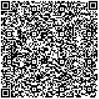

##About
Business Card Brainfuck is a tiny [Brainfuck](http://en.wikipedia.org/wiki/Brainfuck) interpreter which fits on business cards and is only 512 bytes of code. It's inspired by [Business Card Raytracer](http://www.cs.utah.edu/~aek/code/card.cpp) by Paul Heckbert ([more](http://fabiensanglard.net/rayTracing_back_of_business_card/)).  
It exists mostly to demonstrate how easy it is to implement a Brainfuck interpreter and because I was bored one evening. Indented code is located in bf_indent.c.

##Code
```c
#include<stdio.h>  // Krzysztof Gabis 2015
#include<stdlib.h> // Usage: ./bf program
int p[64*1024],d[1024*1024],r,c,t,e;int main(int c,char*v[]){
if(c<2)exit(1);FILE*f=fopen(v[1],"r");while(f&&(c=getc(f))!=
EOF)p[r++]=c;r=0;while((c=p[r])){e=0;if(c=='>')t++;if(c=='<')
t--;if(c=='+')d[t]++;if(c=='-')d[t]--;if(c=='.')putc(d[t],
stdout);if(c==',')d[t]=getc(stdin);while(c=='['&&!d[t]){if(
p[r]=='[')e++;if(p[r]==']'&&e--==1)break;r++;}while(c==']'&&
d[t]){if(p[r]==']')e++;if(p[r]=='['&&e--==1)break;r--;}r++;}}

```

##QR


##Usage

```
make
./bf filename
```

##Examples
```
./bf hw.bf
```
```
curl -s "http://www.99-bottles-of-beer.net/download/1718" > bottles.bf
./bf bottles.bf
```

```
curl -s "http://esoteric.sange.fi/brainfuck/utils/mandelbrot/mandelbrot.b" > mandelbrot.bf
./bf mandelbrot.bf
```

##License
[The MIT License (MIT)](http://opensource.org/licenses/mit-license.php)